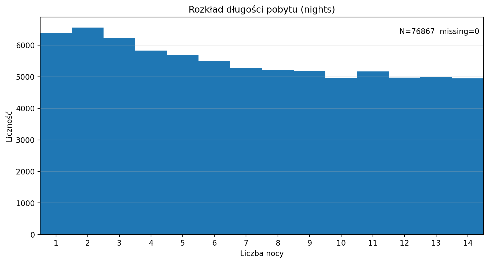
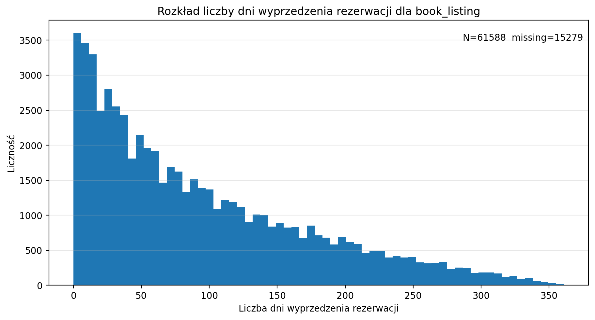
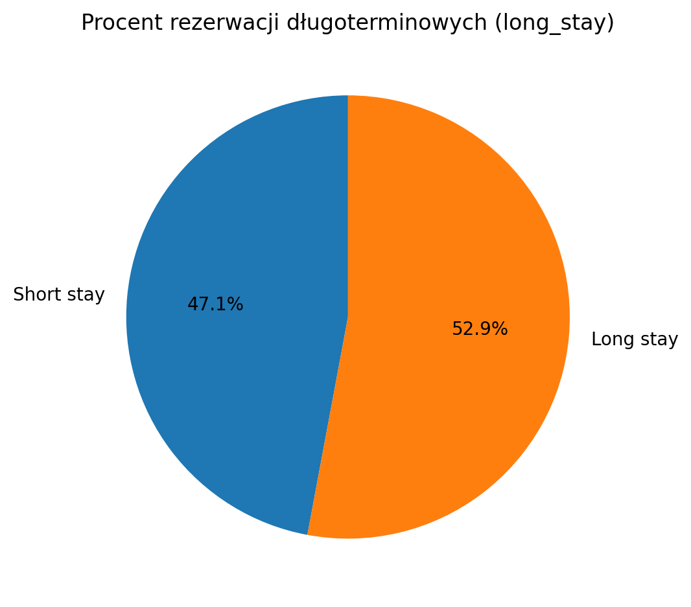
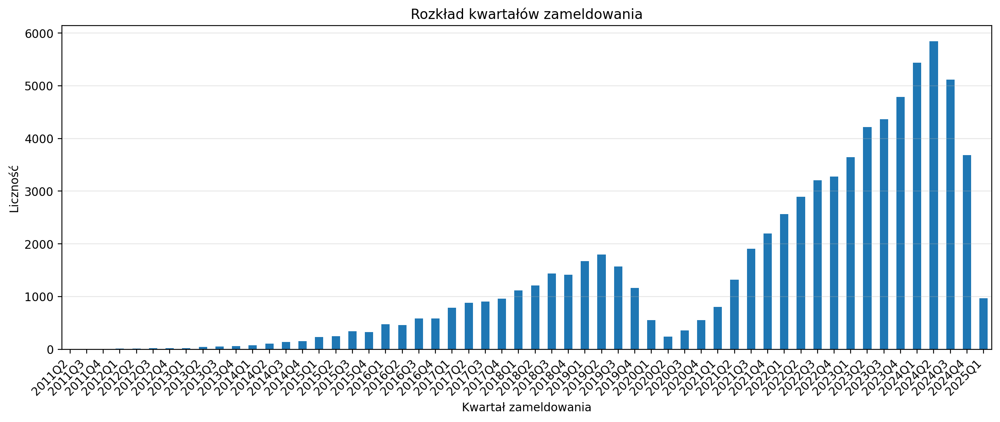
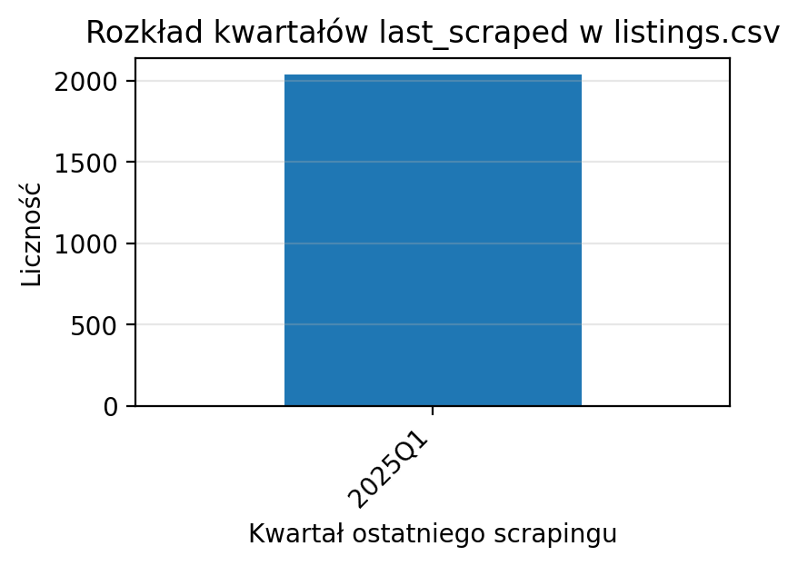
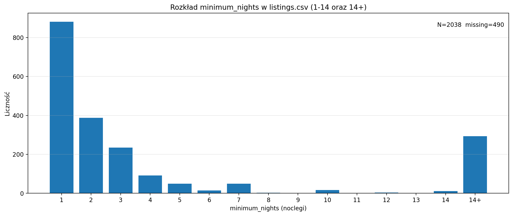

# Analiza danych

## Dostępne atrybuty
W tej sekcji omówimy różne atrybuty dostępne w naszym zestawie danych oraz ich znaczenie.

### Dane listings.csv
W pliku `listings.csv` znajduje się 79 atrybutów między innymi:
- `id`: Unikalny identyfikator oferty.
- `name`: Nazwa oferty.
- `price`: Cena oferty.
- `room_type`: Typ pokoju (np. całe mieszkanie, prywatny pokój).
- `amenities`: Lista udogodnień dostępnych w ofercie np. czy jest pralka.
- tekstowe pola opisowe np. `description`, `neighborhood_overview`.

### Dane reviews.csv
W pliku `reviews.csv` znajduje się 6 atrybutów:
- `listing_id`: Unikalny identyfikator oferty, do której odnosi się recenzja.
- `id`: Unikalny identyfikator recenzji.
- `date`: Data dodania recenzji.
- `reviewer_id`: Unikalny identyfikator recenzenta.
- `reviewer_name`: Imię recenzenta.
- `comments`: Treść recenzji.

### Dane sessions.csv
W pliku `sessions.csv` znajduje się 7 atrybutów:
- `action`: Typ akcji wykonanej przez użytkownika (np. wyszukiwanie, obejrzenie oferty, rezerwacja oferty, odwołanie rezerwacji).
- `user_id`: Identyfikator użytkownika wykonującego akcję.
- `timestamp`: Znacznik czasu wykonania akcji.
- `listing_id`: Identyfikator oferty, na której wykonano.
- `booking_date`: Data rezerwacji oferty.
- `booking_duration`: (Prawdopodobnie) data zakończenia rezerwacji, chociaż nazwa sugeruje że to powinna być liczba!.
- `booking_id`: Identyfikator rezerwacji oferty.

### Dane users.csv
W pliku `users.csv` znajduje się 7 atrybutów:
- `id`: Identyfikator użytkownika.
- `name`: Imię użytkownika.
- `surname`: Nazwisko użytkownika.
- Dane adresowe (prawdopodobnie adres zamieszkania użytkownika):
  - `city`: Miasto.
  - `street`: Ulica.
  - `street_number`: Numer domu.
  - `postal_code`: Kod pocztowy.

## Co jest istotne dla naszego problemu?
Chcemy dowiedzieć się, na podstawie jakich czynników użytkownicy rezerwują długie pobyty. Do zamodelowania problemu niezbędne będą dane występujące w pliku `sessions.csv`, gdyż to właśnie stamtąd możemy uzyskać informacje o długości rezerwacji. Data rozpoczęcia pobytu i data zakończenia pobytu (lub czas trwania rezerwacji - być może jest błąd w kolumnie) są kluczowymi atrybutami do analizy. Stworzymy na ich podstawie pojęcie binarne - `long_stay` - i właśnie to chcemy, żeby model przewidywał jak najlepiej po wytrenowaniu. Z kolei z pliku `listings.csv` możemy pozyskać informacje o cechach ofert, które mogą wpływać na decyzje użytkowników dotyczące długości pobytu, takie jak cena, typ pokoju czy dostępne udogodnienia.  Plik `users.csv` może dostarczyć dodatkowych informacji demograficznych o użytkownikach, które również mogą mieć wpływ na ich wybory rezerwacyjne. Plik `reviews.csv` może być mniej istotny dla naszego konkretnego problemu, ale może dostarczyć dodatkowych informacji o jakości ofert i doświadczeniach użytkowników. 

Atrybuty w pliku `listings.csv` można podzielić zgrubsza na kilka kategorii:
- Ekonomia pobytu: 
    - `price`: Cena prawdopodobnie za noc. Jest ona podana z walutą (np. "$100.00"). Należałoby ją przekształcić na wartość numeryczną.
    - `minimum_nights`: Minimalna liczba nocy, na jaką można dokonać rezerwacji. Niektóre lokale są dostępne np. tylko na dłuższe pobyty (>30 dni).
    - `maximum_nights`: Maksymalna liczba nocy, na jaką można dokonać rezerwacji. Niektóre obiekty mogą zezwalać tylko na krótkie pobyty np. ich maksymalna liczba nocy to 7.
    - `has_availability`: Czy lokal jest dostępny do rezerwacji.
- Standard i udogodnienia:
    - `room_type`: Czy to całe mieszkanie, czy pokój prywatny lub współdzielony. Przy długich pobytach potencjalnie większa przestrzeń i prywatność mogą być ważne.
    - `amenities`: Zawiera listę udogodnień oferowanych przez lokal, takich jak pralka, kuchnia, Wi-Fi, akceptowanie zwierząt itp. Udogodnienia te mogą znacząco wpłynąć na komfort długiego pobytu. Trzeba będzie przetworzyć tę kolumnę, aby wyodrębnić konkretne udogodnienia jako cechy binarne (np. `has_washing_machine`, `has_kitchen`).
    - `accommodates`: Liczba osób, które lokal może pomieścić. Dla dłuższych pobytów może być istotne, czy lokal jest odpowiedni dla większych grup lub rodzin.
    - `bedrooms`, `beds`: Liczba sypialni i łóżek w lokalu. Więcej sypialni i łóżek może być korzystne dla dłuższych pobytów, zwłaszcza dla rodzin lub grup.
    - `bathrooms`: Liczba łazienek w lokalu. Więcej łazienek może zwiększyć komfort podczas dłuższych pobytów.
    - `bathrooms_text`: Opis łazienek - czy są wspólne, prywatne
- Lokalizacja i otoczenie:
    - `neighbourhood_cleansed`: Nazwa dzielnicy, w której znajduje się lokal.
    - `neighbourhood_overview`: Opis okolicy. Dla długich pobytów ważne może być, czy okolica jest spokojna, bezpieczna i czy oferuje udogodnienia takie jak sklepy, restauracje itp. W przeciwieństwie do krótkich pobytów, gdzie lokalizacja w centrum miasta, blisko miejsc turystycznie atrakcyjnych może być bardziej pożądana, długie pobyty mogą wymagać bardziej zrównoważonej lokalizacji.
    - `latitude`, `longitude`: Dokładne współrzędne geograficzne lokalu. Mogą być użyteczne do analizy lokalizacji i jej wpływu na decyzje rezerwacyjne.
- Zaufanie i wiarygodność:
    - `host_is_superhost`: Czy gospodarz ma status superhosta. Gospodarze z tym statusem mogą być postrzegani jako bardziej wiarygodni, co może wpływać na decyzje dotyczące długich pobytów.
    - `host_response_time`: Czas odpowiedzi gospodarza. Szybka odpowiedź może być ważna dla gości planujących dłuższe pobyty. Lepiej, gdy gospodarz szybko odpowiada na zapytania np. within an hour.
    - `review_scores_rating`: Ogólna ocena lokalu.
    - `review_scores_value`: Ocena stosunku jakości do ceny.
    - `number_of_reviews`: Liczba recenzji. Większa liczba recenzji może świadczyć o popularności i zaufaniu do lokalu.

Z pliku `users.csv` nie użyjemy danych personalnych takich jak imię, nazwisko czy ulica. Być może użyjemy atrybut `city`, aby zobaczyć, czy lokalizacja użytkownika ma wpływ na długość rezerwacji np. czy osoby z większych miast rezerwują dłuższe pobyty.

Dane, które są w pliku `reviews.csv` prawdopodobnie nie będą użyte w naszym modelu, ponieważ recenzje są dodawane po zakończeniu pobytu i nie wpływają na decyzję o długości rezerwacji.
Ważniejsza może być zagregowana ocena, które jest już w pliku `listings.csv`.

## Problemy ze złączeniami danych między plikami

Aby wykorzystać dane z różnych plików, musimy je łączyć po kluczach. 
### Złączenie `sessions.csv` ↔ `listings.csv` 
Dla `listings.csv` i `sessions.csv` kluczami są odpowiednio `listings.id` oraz `sessions.listing_id`. Analizę pokrycia wykonujemy w dwóch ujęciach: pokrycie wierszy po złączeniu oraz pokrycie unikalnych kluczy (różnorodności ofert).

- Bez filtrowania po `action`: ok. 74% rekordów `sessions.csv` ma niepusty `listing_id`, a spośród nich ok. 67.6% znajduje dopasowanie w `listings.csv` (łączny row coverage ~50.1%). Jednocześnie tylko ok. 13.2% unikalnych `listing_id` obserwowanych w `sessions.csv` występuje w `listings.csv`, co sugeruje, że `listings.csv` jest ograniczonym podzbiorem ofert, a dopasowania dotyczą głównie najczęściej występujących listingów.

- Dla akcji `book_listing` (rezerwacje): ok. 80% rekordów ma niepusty `listing_id`, jednak tylko ok. 7.7% z nich znajduje dopasowanie w `listings.csv` (łączny row coverage ~6.2%). Oznacza to, że cechy ofert z `listings.csv` będą dostępne tylko dla niewielkiej części rezerwacji; trening modelu oparty głównie o cechy ofert może być przez to niemożliwy lub silnie obciążony selekcją danych.

Jednak zauważyliśmy, że wiele brakujących `id` w `listings.csv` można by było odzyskać, analizując kolumnę `listing_url` i wyciągając z niej identyfikatory ofert. Po naprawie braków w `listings.csv`, ponowiliśmy analizę złączeń:
- Bez filtrowania po `action`: pokrycie wierszy po złączeniu wzrosło do ok. 60.3%, a pokrycie unikalnych kluczy do ok. 15.8%. Natomiast dopasowanie wzrosło do ok. 81.4% rekordów z niepustym `listing_id`.
- Dla akcji `book_listing`: pokrycie wierszy po złączeniu wzrosło do ok. 7.4%, a pokrycie unikalnych kluczy do ok. 9.4%. Dopasowanie wzrosło do ok. 9.3% rekordów z niepustym `listing_id`. Mimo poprawy, cechy ofert z `listings` nadal będą dostępne tylko dla małej części rezerwacji, więc będzie problem z trenowaniem.

Następnie poczyniliśmy obserwację, że wiele rekordów w `sessions.csv` ma nieustawione atrybut `action`, mimo że posiadają daty rezerwacji i wyglądają jak rezerwacje. Dzięki temu pozyskaliśmy dodatkowe 15000 rekordów, które są rezerwacjami. Po ponownym przeanalizowaniu złączeń po naprawie `listings.csv` i uzupełnieniu `sessions.csv`:
- Bez filtrowania po `action`: nie zmieniły się wyniki złączenia.
- Dla akcji `book_listing` (rezerwacje): pokrycie wierszy po złączeniu wyniosło ok. 7.4%, a pokrycie unikalnych kluczy to ok. 9.5% (minimalny wzrost). Dopasowanie wyniosło ok. 9.2% rekordów z niepustym `listing_id` (minimalny spadek). Dalej cechy ofert z `listings` będą dostępne tylko dla małej części rezerwacji. Niemniej jednak dodatkowe rekordy rezerwacji mogą pomóc w trenowaniu modelu.

### Złączenie `sessions.csv` ↔ `users.csv`
Klucz łączący to `sessions.user_id` oraz `users.id`.

- Bez filtrowania po `action`: ok. 80% rekordów `sessions.csv` ma niepusty `user_id`, a spośród nich ok. 80% znajduje dopasowanie w `users.csv` (łączny row coverage ~64%). Pokrycie unikalnych `user_id` wynosi ok. 80%, co sugeruje, że dla większości użytkowników obecnych w sesjach istnieją odpowiadające im dane w `users.csv`, choć ok. 20% identyfikatorów nie jest możliwe do sparowania.

- Dla akcji `book_listing` (rezerwacje): wyniki są bardzo zbliżone.

### Złączenie `reviews.csv` ↔ `users.csv`
Klucz łączący to `reviews.reviewer_id` oraz `users.id`.

- Ok. 80% rekordów `reviews.csv` ma niepusty `reviewer_id`, a spośród nich ok. 80% znajduje dopasowanie w `users.csv` (łączny row coverage ~64%). Pokrycie unikalnych `reviewer_id` wynosi ok. 80%.

### Złączenie `reviews.csv` ↔ `listings.csv`
Klucz łączący to `reviews.listing_id` oraz `listings.id`.

- Ok. 80.1% rekordów w `reviews.csv` ma niepusty `listing_id`. Jednak tylko ok. 7.6% z nich znajduje dopasowanie w `listings.csv`, co daje łączne pokrycie wierszy po złączeniu na poziomie ok. 6.1%. Pokrycie po unikalnych kluczach jest również niskie: tylko ok. 8.0% unikalnych `listing_id` z `reviews.csv` występuje w `listings.csv` (`unique_key_coverage` ~0.0803). Wskazuje to, że `listings.csv` jest ograniczonym podzbiorem ofert i nie pozwala na wzbogacenie większości recenzji o cechy oferty.

## Braki danych
Przeanalizowaliśmy braki danych w plikach. Braki są dosyć duże:
- Plik `listings.csv` ma braki we wszystkich kolumnach - minimum 18% w kolumnie `host_has_profile_pic`, maksimum 100% w kolumnie `calendar_updated`. Jednak dla większości kolumn braki są w przedziale od ok. 20% do 40%. Po naprawie kolumny `id` (opisanej wyżej) braki w tej kolumnie zostały zredukowane do ok. 4.6%.
- Plik `sessions.csv` również ma braki we wszystkich kolumnach minimum ok. 20% w kolumnach `action`, `user_id`, `timestamp`, maksymalne braki to ok. 94% w kolumnach `booking_date`, `booking_duration`, `booking_id`. Po zastosowaniu naprawy i uzupełnienia `action` o brakujące wartości, braki w kolumnie `action` zmalały do 19%. Braki w kolumnach związanych z rezerwacjami są zrozumiałe, ponieważ nie każda sesja kończy się rezerwacją. Jednak zmienną celową `long_stay` można będzie utworzyć tylko dla około 4.7% rekordów, gdyż braki w kolumnach `booking_date` i `booking_duration` nie występują jednocześnie.
- Pliki `users.csv` i `reviews.csv` mają braki we wszystkich kolumnach - minimum na poziomie około 20%.

## Definicja targetu
Na potrzeby naszego problemu zbudujemy dataset `reservations.csv`, który będzie zawierał tylko rekordy z `sessions.csv`, które reprezentują rezerwacje (czyli mają uzupełnione kolumny `booking_date` i `booking_duration`).
Kolumnę `booking_date` nazwiemy `checkin`, a kolumnę `booking_duration` nazwiemy `checkout`. Następnie na ich podstawie zostanie wyliczony czas trwania rezerwacji w dniach jako różnica między `checkout` a `checkin`. Stworzymy nową kolumnę `lead_time_days`, która będzie reprezentować liczbę dni między datą dokonania rezerwacji a datą zameldowania (różnica między `checkin` a datą wyciągniętą z `timestamp`).
Na podstawie czasu trwania rezerwacji zdefiniujemy zmienną docelową `long_stay`, która przyjmie wartość 1, jeśli czas trwania rezerwacji wyniesie co najmniej x dni, w przeciwnym razie przyjmie wartość 0. Docelowo jeśli uda się uzyskać lepsze dane, można będzie rozważyć użycie atrybutów dających większy sygnał do przewidywania długich pobytów.

## Analiza rozkładu długości rezerwacji

Na podstawie na razie dostępnych danych widzimy że rozkład długości rezerwacji jest stosunkowo płaski (delikatna przewaga dla wartości poniżej 7), dla każdej z wartości od 1 do 14. Dlatego proponujemy ustawić próg x na 7 dni, co pozwoli nam zrównoważyć klasy w zmiennej docelowej `long_stay`. Ostateczna wartość progu może być dostosowana na podstawie dalszej analizy rozkładu długości rezerwacji i wymagań biznesowych.

## Analiza rozkładu ile dni przed zameldowaniem jest dokonywana rezerwacja

Widzimy, że większość rezerwacji jest dokonywana na krótko przed datą zameldowania, widzimy wyraźną dominację w przedziale do 30 dni przed zameldowaniem. Jednak istnieje również zauważalna liczba rezerwacji dokonywanych z większym wyprzedzeniem, sięgającym nawet kilkuset dni. 

## Analiza rozkładu zmiennej docelowej long_stay

Widzimy, że około 52.9% rezerwacji to rezerwacje długoterminowe (co najmniej 7 dni), podczas gdy 47.1% to rezerwacje krótkoterminowe (poniżej 7 dni). Oznacza to, że klasy w zmiennej docelowej `long_stay` są stosunkowo zrównoważone, co jest korzystne dla trenowania modeli predykcyjnych.

## Analiza rozkładu kwartałów zameldowania

Widzimy, że pierwsze rezerwacje zaczynają się w drugim kwartale 2011 roku, następnie widzimy dość stabilny wzrost liczby rezerwacji aż do końca 2019 roku. W 2020 roku widzimy spadek liczby rezerwacji, co jest zgodne z globalnym trendem związanym z pandemią COVID-19. Po 2020 roku widzimy ponowny wzrost liczby rezerwacji, co sugeruje powrót do normalności w branży turystycznej. Wzrost ostro przyspiesza aż do ostatniego kwartału 2024 roku. Następnie mamy niski słupek w pierwszym kwartale 2025 roku, co może być związane z brakiem danych za ten okres.

## Analiza rozkładu kwartałów z jakich pochodzą oferty

Widzimy, że oferty w naszym zestawie danych pochodzą tylko z pierwszego kwartału 2025 roku. Jest to duży problem, bo nie mamy wiedzy o tym, jak oferty wyglądały w przeszłości. Standard obiektów mógł się zmieniać w czasie, podobnie jak ceny i dostępność. Cechy z `listings.csv` to snapshot z 2025Q1, więc mogą nie odzwierciedlać stanu historycznego ofert. To w zasadzie wyklucza użycie cech z `listings.csv` do trenowania modelu predykcyjnego dla naszego problemu.

## Analiza rozkładu minimalnej liczby nocy rezerwacji

Widzimy, że większość ofert ma minimalną liczbę nocy ustawioną na 1, co oznacza, że można dokonać rezerwacji na jedną noc. Jednak istnieje również zauważalna liczba ofert z wyższymi minimalnymi wymaganiami, sięgającymi do 14 nocy i więcej. Potencjalnym problemem jest to, że w naszych danych nie ma żadnych rezerwacji dłuższych niż 14 nocy, więc te oferty wogóle nie są reprezentowane w danych rezerwacji.

## Model baseline
Stworzyliśmy dwa proste modele bazowe do przewidywania zmiennej docelowej `long_stay`:
1. Model zwracający zawsze 1 (długoterminowa rezerwacja). Osiągnął on 52.9% dokładności, co jest zgodne z rozkładem klas w danych. Natomiast wartość ROC AUC wyniosła 0.5, co oznacza brak zdolności rozróżniania między klasami.
2. Model oparty na regresji logistycznej wykorzystujący cechy wyłuskane tylko z pliku `sessions.csv` i `users.csv`, bez cech z `listings.csv` ze względu na problemy z danymi historycznymi. Cechy użyte w modelu regresji logistycznej to:
    - `lead_time_days`: liczba dni między datą dokonania rezerwacji a datą zameldowania, wyliczona jako różnica między `checkin` a datą wyciągniętą z `time stamp`. 
    - `checkin_month`: miesiąc zameldowania wyciągnięty z daty `checkin`.
    - `checkin_year`: rok zameldowania wyciągnięty z daty `checkin`.
    - `checkin_dow`: dzień tygodnia zameldowania wyciągnięty z daty `checkin`.
    - `checkin_is_weekend`: czy data zameldowania przypada na weekend (sobota lub niedziela).
    - `user_city`: miasto użytkownika wyciągnięte z pliku `users.csv`.
    - `booking_month`: miesiąc dokonania rezerwacji wyciągnięty z daty w `timestamp`.
    - `booking_dow`: dzień tygodnia dokonania rezerwacji wyciągnięty z daty w `timestamp`.
    - `booking_hour`: godzina dokonania rezerwacji wyciągnięta z daty w `timestamp`.
    - `lead_time_bucket`: kategoryzacja `lead_time_days` na przedziały (1,2-3,4-7,8-14,15-30,31-90,91+).
    - `city_missing`: czy miasto użytkownika jest brakujące w danych.
Model regresji logistycznej osiągnął dokładność około 51.6% oraz wartość ROC AUC około 0.505 na zbiorze testowym. Wyniki te są nieco lepsze niż model bazowy zwracający zawsze 1, ale nadal wskazują na ograniczoną zdolność rozróżniania między klasami. 

| feature | pearson_corr | spearman_corr | mutual_info | cramers_v | chi2_p |
|---|---:|---:|---:|---:|---:|
| user_city | — | — | 0.005817 | 0.020729 | 9.69e-01 |
| checkin_year | -0.008249 | -0.012210 | 0.000397 | 0.028183 | 7.66e-08 |
| lead_time_bucket | — | — | 0.000380 | 0.027508 | 1.07e-09 |
| booking_hour | 0.001695 | 0.001692 | 0.000119 | 0.015417 | 7.90e-01 |
| checkin_month | -0.002166 | -0.002148 | 0.000066 | 0.011485 | 5.18e-01 |
| checkin_dow | 0.005197 | 0.005178 | 0.000061 | 0.011075 | 1.51e-01 |
| booking_dow | 0.003383 | 0.003405 | 0.000056 | 0.010622 | 2.77e-01 |
| booking_month | -0.001477 | -0.001466 | 0.000047 | 0.009668 | 8.45e-01 |
| checkin_is_weekend | 0.005203 | 0.005203 | 0.000014 | 0.005174 | 1.51e-01 |
| city_missing | 0.001506 | 0.001506 | 0.000001 | 0.001480 | 6.81e-01 |
| lead_time_days | -0.006086 | -0.000548 | 0.000000 | — | — |

W powyższej tabeli przedstawiono różne miary statystyczne oceniające związek między cechami a zmienną docelową `long_stay`. Wartości pearsona i spearmana są bardzo niskie dla wszystkich cech, co wskazuje na słabą liniową i monotoniczną zależność. Miary informacji wzajemnej również są bardzo niskie, co sugeruje, że cechy te dostarczają niewiele informacji o zmiennej docelowej. Wartości Cramér's V i p-wartości z testu chi-kwadrat również wskazują na brak istotnych zależności między cechami a `long_stay`. Ogólnie rzecz biorąc, wyniki te sugerują, że dostępne cechy mają ograniczoną zdolność predykcyjną dla naszego problemu.

## Podsumowanie
Spróbowaliśmy zbudować modele bazowe do przewidywania długoterminowych rezerwacji na podstawie tych danych które nie były wybrakowane oraz dały się połączyć na podstawie pary kluczy identyfikujących. Modele te osiągnęły jedynie nieznacznie lepsze wyniki niż proste modele bazowe, co wskazuje na ograniczoną zdolność predykcyjną dostępnych cech. Głównym wyzwaniem jest brak historycznych danych ofert w `listings.csv`, co uniemożliwia wykorzystanie potencjalnie istotnych cech ofert do trenowania modeli. Również problemem jest brak możliwości złączenia wszystkich rezerwacji z cechami ofert ze względu na niezgadzające się identyfikatory. Aby poprawić wyniki, konieczne może być pozyskanie bardziej kompletnych danych historycznych ofert oraz lepsze złączenie danych między plikami. Przydatne mogłyby się też okazać dane dotyczące konkretnych rezerwacji, skąd moglibyśmy pozyskać ceny rezerwacji i inne cechy.

